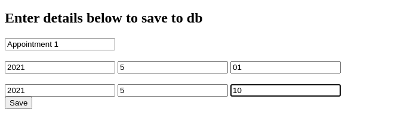
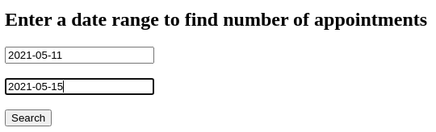

# WisdomLeaf

### Description : Find total number of appointments and its data between given two date range

#
### Mongo Database : wisdomleaf
### Collection name : appointment

#

### Run Instruction : python(3) app.py

>Data Insertion Sample :  

> Data Querying sample :  
